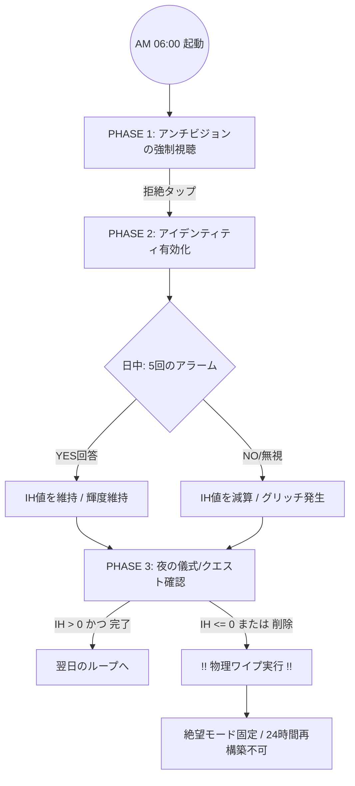

アプリ実装定義書：One Day OS（人生強制執行システム）
このプロンプトをそのまま開発AIに渡し、実装を開始させてください。

# 1. プロダクト・コンセプト

コア・コピー: 「人生を立て直すのに、何年もいらない。必要なのは真剣な1日だけだ。」

目的: 行動ではなく「アイデンティティ（在り方）」を24時間監視し、物理的に書き換える 。

原則: サーバーレス（完全ローカル）、不可逆（バックアップ禁止）、ミニマリズム 。

# 2. ユーザー体験（UX）フローチャート
このMermaidコードに基づき、状態遷移を実装せよ。

# 3. 詳細実装・ロジック定義

## A. アイデンティティ・エンジンの数値仕様

Identity Health (IH): 0〜100%の内部パラメータ。

減算トリガー:
- 日中の通知を無視、または「NO（自己防衛）」と回答した場合に -15% 。
- 夜のクエストが未達成の場合に -20% 。

データ消去（Wipe）: IH <= 0 になった瞬間、ローカルの全DBテーブルを消去。バックアップからの復元をシステムレベルで禁止する 。

## B. PHASE別画面仕様

### Morning Layer (AM 6:00-9:00):
- 設定した「アンチビジョン（絶対に生きたくない5年後の火曜日）」を全画面で自動スクロール表示 。
- ユーザーに「この未来を拒絶する」という意思決定を1タップで行わせる。

### Core Identity Layer (Main):
- 中央に「私は〜な人間だ（I am a person who...）」というステートメントを表示 。
- 3層レンズ（ピンチズーム操作）:
  - 0.5x (1 Year): パターンを破るミッション 。
  - 1.0x (Identity): 在り方の定義 。
  - 2.0x (1 Day): 今日実行する2つのクエスト 。

### Evening Layer (PM 20:00-24:00):
- その日の「停滞の理由」と「本当の敵（内部の習慣や信念）」を特定・命名させる 。

## C. 審判の5段階（通知スケジュール）

以下の時間にOS標準のLocal Notificationを発火させ、ロック画面上で「YES/NO」の2択を迫る。

| 時間 | 質問 |
|------|------|
| 11:00 | 何を避けようとしているか？ |
| 13:30 | 観察者は君を「何を望んでいる人間」と結論づけるか？ |
| 15:15 | 嫌いな人生か、欲しい人生か？ |
| 17:00 | 重要でないふりをしている「最重要のこと」は？ |
| 19:30 | 今日の行動は本当の欲求か、自己防衛か？ |

# 4. 技術スタック & 制限事項

**Storage:** SQLiteまたはRealm。iCloud/Google Driveへの同期設定は明示的に無効化すること。

**Visual:** IHの低下に合わせて、メイン画面の文字にグリッチ（ノイズ）エフェクトを適用。

**禁止事項:**
- ポジティブな励ましや報酬、バッジ等のゲーミフィケーション要素の排除 。
- 過去の記録（ログ）を振り返る機能の廃止。
- 外部サーバーとの一切の通信。

---

この仕様書に基づき、まずは**「Identity Healthが0になった際に全てを消去するロジック」と、「5つの定時通知システム」**の構築から開始してください。
