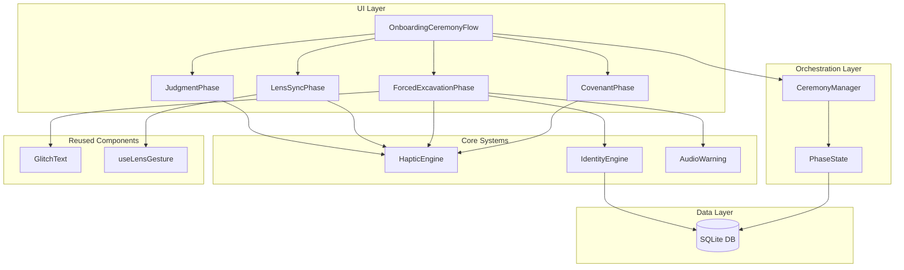
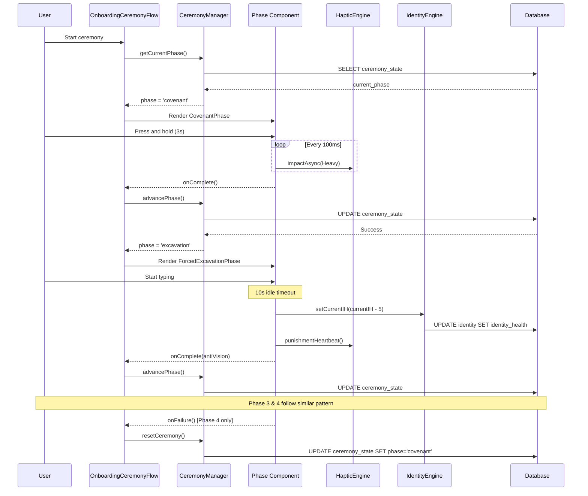

# Onboarding Ceremony Implementation Plan

**Status:** Draft
**Created:** 2026-02-04
**Feature:** Onboarding Ceremony System
**Complexity:** Medium-High

---

## Document Overview

This document defines the implementation plan for the **Onboarding Ceremony** system - a four-phase ritualistic onboarding experience that enforces deliberate commitment through haptic feedback, forced excavation of anti-vision, lens gesture training, and judgment testing.

---

## Table of Contents

1. [Agreement Checklist](#agreement-checklist)
2. [Existing Codebase Analysis](#existing-codebase-analysis)
3. [Feature Overview](#feature-overview)
4. [Prerequisite ADRs](#prerequisite-adrs)
5. [Technical Requirements](#technical-requirements)
6. [Architecture Design](#architecture-design)
7. [Component Structure](#component-structure)
8. [State Management Flow](#state-management-flow)
9. [Implementation Approach](#implementation-approach)
10. [Integration Point Map](#integration-point-map)
11. [Change Impact Map](#change-impact-map)
12. [File Structure](#file-structure)
13. [Implementation Phases](#implementation-phases)
14. [Acceptance Criteria](#acceptance-criteria)
15. [Testing Strategy](#testing-strategy)
16. [Non-Functional Requirements](#non-functional-requirements)
17. [Risk Assessment](#risk-assessment)
18. [References](#references)

---

## Agreement Checklist

### Scope (What to Change)
- [ ] Create 4-phase ceremony flow replacing current simple onboarding
- [ ] Implement Force Hold (3-second LongPress) for covenant acceptance
- [ ] Implement Forced Excavation with 10-second timeout and IH penalty
- [ ] Implement Lens Synchronization requiring 2.0x pinch zoom
- [ ] Implement Judgment Test with 5-second response window
- [ ] Integrate with existing HapticEngine, IdentityEngine, GlitchText, and StressContainer

### Non-Scope (What Not to Change)
- [ ] Existing onboarding data storage (identity, anti-vision, mission, quests tables remain unchanged)
- [ ] Existing HapticEngine methods (only use existing API)
- [ ] Existing IdentityEngine penalty system (only call existing `setCurrentIH` method)
- [ ] Main app navigation and tab structure
- [ ] Brutalist design system principles

### Constraints
- [ ] Must work on mobile only (Android/iOS)
- [ ] No haptic feedback on web (graceful degradation)
- [ ] Must maintain brutalist design (black/white/red, monospace, no rounded corners)
- [ ] All phases must complete sequentially (no skipping)
- [ ] Phase 4 failure resets to Phase 1 (harsh reset)
- [ ] Must integrate with expo-av for audio warnings
- [ ] Cannot modify database schema

### Performance Requirements
- [ ] Haptic feedback must fire within 50ms of trigger
- [ ] Force Hold progress animation must be smooth (60fps)
- [ ] Timeout detection must be accurate within ±500ms
- [ ] Gesture detection (pinch zoom) must respond within 100ms
- [ ] Audio warning playback latency < 200ms

### Design Constraints
- [ ] No encouraging messages (brutalist honesty)
- [ ] No soft animations (abrupt transitions only, ≤100ms)
- [ ] Red glitch effects for warnings
- [ ] Heavy haptic feedback for resistance/punishment
- [ ] Monospace font throughout

### Reflection in Design
- **Phase 1 Force Hold**: Covenant section implements LongPress with HapticEngine.impactAsync(Heavy)
- **Phase 2 Forced Excavation**: Timer and IH penalty via IdentityEngine integration
- **Phase 3 Lens Sync**: Pinch gesture handler with zoom tracking
- **Phase 4 Judgment Test**: Notification simulation with timeout detection
- **Brutalist Design**: All components use theme.ts colors, monospace fonts, no rounded corners
- **Sequential Flow**: CeremonyManager tracks phase progression, blocks skipping
- **Harsh Reset**: Phase 4 failure triggers full ceremony restart

---

## Existing Codebase Analysis

### Current Onboarding Implementation

**Location:**
- `app/onboarding/index.tsx` - Route entry point
- `src/ui/screens/onboarding/OnboardingFlow.tsx` - Main flow component
- `src/core/onboarding/OnboardingManager.ts` - Manager singleton

**Current Structure:**
```typescript
// 5-step simple flow
1. Welcome - Introduction screen
2. Anti-Vision - Text input (single field)
3. Identity - Text input with "私は〜な人間だ" prefix
4. Mission - Multi-line text input
5. Quests - Two quest text inputs
```

**Key Findings:**
- Uses `OnboardingManager` singleton pattern
- Persists to database via `completeStep()` method
- Routes to main app via `router.replace('/(tabs)')` on completion
- Updates app_state to 'active' on completion
- No haptic feedback currently
- No time-based constraints
- No gesture requirements

### Similar Functionality Search

**Search Patterns:**
- Gesture handling: `useLensGesture.ts` (pinch zoom implementation exists)
- Timeout mechanisms: `NotificationHandler.ts` (5-minute timeout exists)
- Timer UI: None found (need to implement)
- Audio playback: None found (need to add expo-av)

**Decision:**
- **Reuse:** `useLensGesture.ts` hook for pinch zoom detection
- **Reuse:** HapticEngine for all haptic feedback
- **Reuse:** GlitchText and StressContainer for visual effects
- **New Implementation:** Force Hold component (no similar pattern exists)
- **New Implementation:** Forced Excavation timer (no countdown UI exists)
- **New Implementation:** Judgment Test notification simulation
- **New Implementation:** CeremonyManager to orchestrate phases

### Existing Interface Investigation

**OnboardingManager (src/core/onboarding/OnboardingManager.ts):**
```typescript
// Public API
static async getInstance(): Promise<OnboardingManager>
async completeStep(step: OnboardingStep, data: any): Promise<void>
async getCurrentStep(): Promise<OnboardingStep>
async isOnboardingComplete(): Promise<boolean>
```

**Call Sites:**
- `OnboardingFlow.tsx` lines 40, 101, 102, 105 - Main usage

**Integration Decision:**
- **Extend:** Add new `completeCeremony()` method for ceremony-specific completion
- **Preserve:** Keep existing `completeStep()` for backward compatibility
- **New:** Create `CeremonyManager` as separate orchestrator

### Reusable Components

**HapticEngine (src/core/HapticEngine.ts):**
```typescript
async pulseHeartbeat()     // Used for Phase 2 warnings
async punishFailure()      // Used for Phase 4 failure
async snapLens()           // Used for Phase 3 success
async lightClick()         // Not used in ceremony
async punishmentHeartbeat() // Used for Phase 2 penalties
```

**GlitchText (src/ui/effects/GlitchText.tsx):**
- Props: `text, style, severity (0-1), health (0-100)`
- Used for Phase 2 red glitch warnings

**StressContainer (src/ui/layout/StressContainer.tsx):**
- Wraps content with IH-based visual effects
- Not directly used in ceremony (onboarding has no IH effects yet)

**useLensGesture Hook (src/ui/lenses/useLensGesture.ts):**
```typescript
// Existing pinch zoom detection
const { scale, onGestureEvent } = useLensGesture();
```
- Reused for Phase 3 zoom detection

---

## Feature Overview

### Purpose
Replace the current simple onboarding flow with a **ceremonial experience** that enforces commitment through:
1. Physical resistance (Force Hold)
2. Psychological excavation (Timed anti-vision entry)
3. Skill demonstration (Gesture training)
4. Judgment assessment (Response time test)

### User Journey

```
┌──────────────────────────────────────────────────────────┐
│                   ONBOARDING CEREMONY                     │
└──────────────────────────────────────────────────────────┘
                          │
                          ▼
        ┌─────────────────────────────────┐
        │  Phase 1: COVENANT              │
        │  - Hold button for 3 seconds    │
        │  - Heavy haptic resistance      │
        │  - Progress ring animation      │
        │  - Early release = reset        │
        └─────────────────────────────────┘
                          │
                          ▼
        ┌─────────────────────────────────┐
        │  Phase 2: FORCED EXCAVATION     │
        │  - Enter anti-vision (3 lines)  │
        │  - 10s idle = -5% IH + warning  │
        │  - Red glitch on timeout        │
        │  - Cannot proceed until input   │
        └─────────────────────────────────┘
                          │
                          ▼
        ┌─────────────────────────────────┐
        │  Phase 3: LENS SYNCHRONIZATION  │
        │  - Pinch zoom to 2.0x           │
        │  - Mid-way cancel = glitch      │
        │  - Success = snap haptic        │
        └─────────────────────────────────┘
                          │
                          ▼
        ┌─────────────────────────────────┐
        │  Phase 4: JUDGMENT TEST         │
        │  - Dummy notification appears   │
        │  - 5s to press YES              │
        │  - NO/Timeout = FULL RESET      │
        └─────────────────────────────────┘
                          │
                          ▼
                 [ Main App Entry ]
```

### Behavioral Requirements

1. **Sequential Enforcement**: Phases must complete in order 1→2→3→4
2. **No Skipping**: Cannot bypass any phase
3. **Harsh Reset**: Phase 4 failure returns to Phase 1, losing all progress
4. **State Persistence**: Current phase saved to database for app restart recovery
5. **IH Integration**: Phase 2 timeout deducts 5% IH via IdentityEngine

---

## Prerequisite ADRs

### Common ADR Requirements
No existing common ADRs found in `docs/adr/`. The following common ADRs should be created:

**Recommended Common ADRs** (can be created in parallel or deferred):
- `ADR-COMMON-001-HAPTIC-PATTERNS.md` - Standard haptic feedback usage patterns
- `ADR-COMMON-002-TIMEOUT-MECHANISMS.md` - Timeout detection and penalty application
- `ADR-COMMON-003-GESTURE-HANDLING.md` - Touch gesture patterns and thresholds

**Note:** Since no common ADRs exist, this plan proceeds with inline architectural decisions.

---

## Technical Requirements

### Dependencies

**Existing:**
- `expo-haptics` (already installed)
- `react-native-gesture-handler` (already installed for lens gestures)
- `expo-router` (navigation)
- `expo-sqlite` (state persistence)

**New:**
- `expo-av` (audio playback for warnings) - **Required Installation**

### Platform Support
- iOS: Full haptic + audio support
- Android: Haptic simulation + audio support
- Web: Graceful degradation (no haptics, no audio)

### Performance Constraints
- Haptic latency: < 50ms
- Animation frame rate: 60fps (16.67ms per frame)
- Timeout accuracy: ±500ms
- Gesture response: < 100ms
- Audio playback latency: < 200ms

---

## Architecture Design

### Architecture Diagram



### Data Flow Diagram



---

## Component Structure

### Component Hierarchy

```
OnboardingCeremonyFlow (Container)
├── CeremonyProgress (Visual progress indicator)
├── Phase Components (Conditional rendering)
│   ├── CovenantPhase
│   │   ├── ForceHoldButton
│   │   └── ProgressRing
│   ├── ForcedExcavationPhase
│   │   ├── TimerDisplay
│   │   ├── AntiVisionInput (3 separate fields)
│   │   ├── GlitchText (reused)
│   │   └── TimeoutWarning
│   ├── LensSyncPhase
│   │   ├── ZoomVisualization
│   │   ├── GestureArea
│   │   └── useLensGesture (reused hook)
│   └── JudgmentPhase
│       ├── DummyNotification
│       ├── ResponseButtons (YES/NO)
│       └── CountdownTimer
└── CeremonyResetModal (Phase 4 failure)
```

### Component Responsibilities

| Component | Responsibility | State Management |
|-----------|----------------|------------------|
| **OnboardingCeremonyFlow** | Orchestrate phase transitions, manage CeremonyManager | Current phase, ceremony completion |
| **CovenantPhase** | 3-second force hold with progress animation | Hold progress (0-100%), is holding |
| **ForcedExcavationPhase** | Timed anti-vision input with penalties | 3 text fields, idle timer, timeout count |
| **LensSyncPhase** | Pinch zoom gesture training | Current scale (1.0-2.0), gesture active |
| **JudgmentPhase** | 5-second response test with reset on failure | Time remaining, user response |
| **CeremonyManager** | Phase state persistence, validation | Current phase, phase completion flags |

---

## State Management Flow

### CeremonyManager State Machine

```typescript
type CeremonyPhase = 'covenant' | 'excavation' | 'lens_sync' | 'judgment';

interface CeremonyState {
  current_phase: CeremonyPhase;
  covenant_completed: boolean;
  excavation_completed: boolean;
  lens_sync_completed: boolean;
  judgment_completed: boolean;
  ceremony_data: {
    anti_vision?: string;
    // Other onboarding data follows existing schema
  };
}
```

**State Transitions:**
```
covenant -> excavation -> lens_sync -> judgment -> COMPLETE
    ↑                                      |
    └──────────── RESET (on failure) ─────┘
```

### Phase-Specific State

**Phase 1: Covenant**
```typescript
interface CovenantState {
  isHolding: boolean;
  holdProgress: number; // 0-100
  holdStartTime: number | null;
}
```

**Phase 2: Excavation**
```typescript
interface ExcavationState {
  antiVisionLines: [string, string, string];
  lastInputTime: number;
  idleTimeoutCount: number; // Number of 10s timeouts hit
  currentIH: number;
}
```

**Phase 3: Lens Sync**
```typescript
interface LensSyncState {
  currentScale: number; // 1.0 - 2.0
  targetScale: 2.0;
  gestureActive: boolean;
  attempts: number;
}
```

**Phase 4: Judgment**
```typescript
interface JudgmentState {
  timeRemaining: number; // 5s countdown
  userResponse: 'YES' | 'NO' | null;
  timedOut: boolean;
}
```

---

## Implementation Approach

### Strategy: Vertical Slice (Feature-driven)

**Rationale:**
- Each phase is a self-contained feature with clear acceptance criteria
- Early validation of haptic/audio/gesture integration
- Users can experience complete phases incrementally
- Low inter-phase dependencies (only phase transition logic)

### Phase Dependencies

```
Phase 1 (Covenant) → Independent
Phase 2 (Excavation) → Depends on IdentityEngine integration
Phase 3 (Lens Sync) → Depends on useLensGesture reuse
Phase 4 (Judgment) → Depends on Phases 1-3 completion
```

### Integration Points

| Phase | Integration Trigger | E2E Verification |
|-------|---------------------|------------------|
| Phase 1 | User can complete 3s hold | L1: Hold completes, advances to Phase 2 |
| Phase 2 | User can input text with timeout penalties | L1: Input saves, IH deducts on timeout |
| Phase 3 | User can pinch zoom to 2.0x | L1: Zoom succeeds, advances to Phase 4 |
| Phase 4 | User can respond within 5s | L1: YES advances to app, NO/timeout resets |

**Verification Level Priority:** L1 (Functional) > L2 (Test) > L3 (Build)

---

## Integration Point Map

### Integration Point 1: HapticEngine Connection
**Existing Component:** `src/core/HapticEngine.ts`
**Integration Method:** Call existing methods from phase components
**Impact Level:** Low (Read-Only API calls)
**Required Test Coverage:** Verify haptic triggers fire at correct times

### Integration Point 2: IdentityEngine IH Deduction
**Existing Component:** `src/core/identity/IdentityEngine.ts`
**Integration Method:** Call `setCurrentIH(currentIH - 5)` on timeout
**Impact Level:** High (Modifies IH state)
**Required Test Coverage:**
- Verify IH deduction occurs on timeout
- Verify persistence to database
- Verify no wipe trigger at high IH (>5%)

### Integration Point 3: useLensGesture Hook Reuse
**Existing Component:** `src/ui/lenses/useLensGesture.ts`
**Integration Method:** Import and use hook for scale tracking
**Impact Level:** Low (Read-Only hook usage)
**Required Test Coverage:** Verify scale detection reaches 2.0x threshold

### Integration Point 4: GlitchText Reuse
**Existing Component:** `src/ui/effects/GlitchText.tsx`
**Integration Method:** Render with high severity on timeout
**Impact Level:** Low (Presentation only)
**Required Test Coverage:** Verify red glitch appears on timeout

### Integration Point 5: Database Schema Extension
**Existing Component:** SQLite database
**Integration Method:** Add `ceremony_state` table (new)
**Impact Level:** Medium (Schema addition, no existing data modification)
**Required Test Coverage:**
- Verify phase persistence across app restarts
- Verify state migration from old onboarding

### Integration Point 6: OnboardingManager Extension
**Existing Component:** `src/core/onboarding/OnboardingManager.ts`
**Integration Method:** Add ceremony-specific completion method
**Impact Level:** Medium (API extension, existing behavior preserved)
**Required Test Coverage:**
- Verify existing onboarding flow unaffected
- Verify ceremony completion routes correctly

---

## Change Impact Map

### Change Target 1: Onboarding Flow Entry
**Component:** `app/onboarding/index.tsx`
**Direct Impact:**
- Route now points to OnboardingCeremonyFlow instead of OnboardingFlow
- File modified: `app/onboarding/index.tsx` (1 line change)

**Indirect Impact:**
- Old OnboardingFlow becomes legacy (keep for rollback)
- All onboarding tests need ceremony variants

**No Ripple Effect:**
- Main app tabs (`app/(tabs)/`)
- Identity/Quest data structures
- Notification system

### Change Target 2: IdentityEngine.setCurrentIH()
**Component:** `src/core/identity/IdentityEngine.ts`
**Direct Impact:**
- New caller: ForcedExcavationPhase (Phase 2)
- Method called on 10s timeout

**Indirect Impact:**
- IH value changes earlier in user lifecycle (during onboarding)
- Potential for wipe during onboarding (if user hits timeout 20 times)

**No Ripple Effect:**
- Existing notification penalty system
- Quest penalty system
- Daily reset logic

### Change Target 3: Database Schema
**Component:** `src/database/schema.ts`
**Direct Impact:**
- New table: `ceremony_state` (5 columns)
- Migration script needed

**Indirect Impact:**
- Database initialization logic updated
- Potential migration from old onboarding_state

**No Ripple Effect:**
- Existing tables (identity, quests, notifications, daily_state)
- WipeManager (deletes all tables anyway)

---

## File Structure

### New Files

```
src/ui/screens/onboarding/
├── ceremony/
│   ├── OnboardingCeremonyFlow.tsx          (Main container)
│   ├── OnboardingCeremonyFlow.test.tsx
│   ├── phases/
│   │   ├── CovenantPhase.tsx               (Phase 1)
│   │   ├── CovenantPhase.test.tsx
│   │   ├── ForcedExcavationPhase.tsx       (Phase 2)
│   │   ├── ForcedExcavationPhase.test.tsx
│   │   ├── LensSyncPhase.tsx               (Phase 3)
│   │   ├── LensSyncPhase.test.tsx
│   │   ├── JudgmentPhase.tsx               (Phase 4)
│   │   └── JudgmentPhase.test.tsx
│   ├── components/
│   │   ├── ForceHoldButton.tsx             (Phase 1 button)
│   │   ├── ForceHoldButton.test.tsx
│   │   ├── ProgressRing.tsx                (Phase 1 animation)
│   │   ├── ProgressRing.test.tsx
│   │   ├── TimerDisplay.tsx                (Phase 2 countdown)
│   │   ├── TimerDisplay.test.tsx
│   │   ├── ZoomVisualization.tsx           (Phase 3 visual)
│   │   ├── ZoomVisualization.test.tsx
│   │   ├── DummyNotification.tsx           (Phase 4 notification)
│   │   ├── DummyNotification.test.tsx
│   │   └── CeremonyResetModal.tsx          (Phase 4 failure modal)
│   └── hooks/
│       ├── useForceHold.ts                 (Phase 1 logic)
│       ├── useForceHold.test.ts
│       ├── useIdleTimer.ts                 (Phase 2 timeout)
│       ├── useIdleTimer.test.ts
│       └── useCountdown.ts                 (Phase 4 timer)

src/core/ceremony/
├── CeremonyManager.ts                       (Orchestrator singleton)
├── CeremonyManager.test.ts
└── AudioWarning.ts                          (expo-av wrapper)

src/database/
├── ceremonySchema.ts                        (New table schema)
└── migrations/
    └── 001_add_ceremony_state.ts
```

### Modified Files

```
app/onboarding/index.tsx                     (Route to ceremony flow)
src/core/onboarding/OnboardingManager.ts     (Add ceremony completion method)
src/database/schema.ts                       (Include ceremony schema)
```

### File Size Estimates

| File | Estimated LOC | Complexity |
|------|---------------|------------|
| OnboardingCeremonyFlow.tsx | 250-300 | Medium |
| CovenantPhase.tsx | 150-200 | Medium |
| ForcedExcavationPhase.tsx | 200-250 | High |
| LensSyncPhase.tsx | 150-180 | Medium |
| JudgmentPhase.tsx | 180-220 | High |
| CeremonyManager.ts | 200-250 | High |
| ForceHoldButton.tsx | 100-120 | Low |
| ProgressRing.tsx | 80-100 | Low |
| useForceHold.ts | 60-80 | Medium |
| useIdleTimer.ts | 80-100 | Medium |
| useCountdown.ts | 50-60 | Low |
| AudioWarning.ts | 60-80 | Low |

**Total Estimated LOC:** ~1,800-2,200 lines (including tests)

---

## Implementation Phases

### Phase 1: Foundation & Infrastructure (3-4 days)

**Goal:** Set up ceremony orchestration and database layer

**Tasks:**
1. **Database Schema & Migration**
   - [ ] Create `ceremonySchema.ts` with `ceremony_state` table
   - [ ] Write migration script `001_add_ceremony_state.ts`
   - [ ] Add schema to main `schema.ts`
   - [ ] Test migration on empty and existing databases
   - **Tests:** Database schema tests, migration rollback tests
   - **Verification:** L3 (Build success)

2. **CeremonyManager Singleton**
   - [ ] Implement `CeremonyManager.ts` core logic
   - [ ] Methods: `getCurrentPhase()`, `advancePhase()`, `resetCeremony()`, `completeCeremony()`
   - [ ] Phase validation (sequential progression)
   - [ ] State persistence to database
   - [ ] Write unit tests for state machine
   - **Tests:** Phase transition tests, persistence tests, validation tests
   - **Verification:** L2 (Tests pass)

3. **AudioWarning Utility**
   - [ ] Install `expo-av` dependency
   - [ ] Create `AudioWarning.ts` wrapper
   - [ ] Methods: `playWarning()`, `stopWarning()`
   - [ ] Platform detection (web graceful degradation)
   - [ ] Load warning sound asset
   - [ ] Write audio playback tests (mocked on web)
   - **Tests:** Playback tests, error handling tests
   - **Verification:** L3 (Build success)

**E2E Verification:**
- CeremonyManager can persist and restore phase state
- Audio warning plays on iOS/Android, no crash on web

---

### Phase 2: Covenant Phase (Phase 1) (2-3 days)

**Goal:** Implement force hold button with haptic resistance

**Tasks:**
1. **useForceHold Hook**
   - [ ] Create `useForceHold.ts` custom hook
   - [ ] Track hold start time, current progress (0-100%)
   - [ ] Trigger haptic every 100ms during hold
   - [ ] Reset on early release
   - [ ] Return: `{ isHolding, progress, onPressIn, onPressOut }`
   - [ ] Write unit tests
   - **Tests:** Hold timing tests, reset tests, haptic trigger tests
   - **Verification:** L2 (Tests pass)

2. **ProgressRing Component**
   - [ ] Create `ProgressRing.tsx` animated ring
   - [ ] Use `Animated.Value` for smooth 60fps animation
   - [ ] Red stroke that fills over 3 seconds
   - [ ] Brutalist style (no gradients, harsh edges)
   - [ ] Props: `progress: number (0-100)`
   - [ ] Write snapshot tests
   - **Tests:** Animation tests, rendering tests
   - **Verification:** L3 (Build success)

3. **ForceHoldButton Component**
   - [ ] Create `ForceHoldButton.tsx`
   - [ ] Integrate `useForceHold` hook
   - [ ] Render ProgressRing overlay
   - [ ] Emit `onComplete()` at 100% progress
   - [ ] Haptic resistance via `HapticEngine.impactAsync(Heavy)`
   - [ ] Write integration tests
   - **Tests:** Completion tests, early release tests, haptic tests
   - **Verification:** L2 (Tests pass)

4. **CovenantPhase Component**
   - [ ] Create `CovenantPhase.tsx`
   - [ ] Render title: "COVENANT" (brutalist style)
   - [ ] Instructional text: "HOLD TO ACCEPT CONTRACT"
   - [ ] Include ForceHoldButton
   - [ ] Call `onPhaseComplete()` on button completion
   - [ ] Write E2E tests
   - **Tests:** Phase completion flow, UI tests
   - **Verification:** L1 (Phase completes, advances to next)

**E2E Verification:**
- User can hold button for 3 seconds
- Haptic feedback fires during hold
- Progress ring animates smoothly
- Releasing early resets progress
- Completion advances to Phase 2

---

### Phase 3: Forced Excavation Phase (Phase 2) (3-4 days)

**Goal:** Implement timed anti-vision input with IH penalties

**Tasks:**
1. **useIdleTimer Hook**
   - [ ] Create `useIdleTimer.ts`
   - [ ] Track last user input timestamp
   - [ ] Detect 10s idle periods
   - [ ] Emit `onTimeout()` callback
   - [ ] Reset timer on any input change
   - [ ] Return: `{ timeRemaining, resetTimer }`
   - [ ] Write unit tests
   - **Tests:** Timeout detection, reset tests
   - **Verification:** L2 (Tests pass)

2. **TimerDisplay Component**
   - [ ] Create `TimerDisplay.tsx`
   - [ ] Show countdown: "XX seconds remaining"
   - [ ] Red text when < 3s remaining
   - [ ] GlitchText effect when timeout hits
   - [ ] Props: `timeRemaining: number, hasTimedOut: boolean`
   - [ ] Write snapshot tests
   - **Tests:** Rendering tests, color change tests
   - **Verification:** L3 (Build success)

3. **ForcedExcavationPhase Component**
   - [ ] Create `ForcedExcavationPhase.tsx`
   - [ ] Render title: "FORCED EXCAVATION"
   - [ ] 3 separate TextInput fields (line 1, 2, 3)
   - [ ] Integrate `useIdleTimer` hook
   - [ ] On timeout:
     - Call `IdentityEngine.getInstance().then(ie => ie.getCurrentIH().then(ih => ie.setCurrentIH(ih - 5)))`
     - Play `AudioWarning.playWarning()`
     - Trigger `HapticEngine.punishmentHeartbeat()`
     - Show GlitchText warning
   - [ ] Disable "Next" button until all 3 lines filled
   - [ ] Call `onPhaseComplete({ antiVision: line1 + line2 + line3 })`
   - [ ] Write integration tests
   - **Tests:** Timeout penalty tests, IH deduction tests, completion tests
   - **Verification:** L1 (Input saves, IH deducts on timeout)

**E2E Verification:**
- User can input text in 3 fields
- 10s idle triggers:
  - IH deduction (-5%)
  - Audio warning plays
  - Punishment haptic fires
  - Red glitch effect appears
- Completion saves anti-vision and advances to Phase 3

---

### Phase 4: Lens Synchronization Phase (Phase 3) (2-3 days)

**Goal:** Implement pinch zoom gesture training

**Tasks:**
1. **ZoomVisualization Component**
   - [ ] Create `ZoomVisualization.tsx`
   - [ ] Display current scale: "1.5x / 2.0x"
   - [ ] Progress bar (1.0 → 2.0)
   - [ ] Red border until 2.0x reached, then green
   - [ ] Props: `currentScale: number, targetScale: number`
   - [ ] Write snapshot tests
   - **Tests:** Rendering tests, color change tests
   - **Verification:** L3 (Build success)

2. **LensSyncPhase Component**
   - [ ] Create `LensSyncPhase.tsx`
   - [ ] Render title: "LENS SYNCHRONIZATION"
   - [ ] Instructions: "PINCH ZOOM TO 2.0x"
   - [ ] Import and use `useLensGesture` hook
   - [ ] Track scale via `scale` from hook
   - [ ] Render ZoomVisualization with current scale
   - [ ] On scale < 1.5 after > 1.5:
     - Trigger `GlitchText` glitch effect
     - Call `HapticEngine.punishFailure()`
   - [ ] On scale >= 2.0:
     - Call `HapticEngine.snapLens()`
     - Call `onPhaseComplete()`
   - [ ] Write integration tests
   - **Tests:** Zoom detection tests, glitch on cancel tests, completion tests
   - **Verification:** L1 (Zoom to 2.0x succeeds, advances to Phase 4)

**E2E Verification:**
- User can pinch zoom on gesture area
- Current scale displays in real-time
- Mid-way cancel triggers glitch + punishment haptic
- Reaching 2.0x triggers snap haptic and advances to Phase 4

---

### Phase 5: Judgment Test Phase (Phase 4) (3-4 days)

**Goal:** Implement 5-second response test with harsh reset

**Tasks:**
1. **useCountdown Hook**
   - [ ] Create `useCountdown.ts`
   - [ ] Start countdown from 5 seconds
   - [ ] Update every 100ms for smooth display
   - [ ] Emit `onTimeout()` at 0s
   - [ ] Return: `{ timeRemaining, start, stop }`
   - [ ] Write unit tests
   - **Tests:** Countdown accuracy tests, timeout tests
   - **Verification:** L2 (Tests pass)

2. **DummyNotification Component**
   - [ ] Create `DummyNotification.tsx`
   - [ ] Render fake notification card
   - [ ] Title: "ONE DAY OS NOTIFICATION"
   - [ ] Message: "Who are you?" (first Five Question)
   - [ ] Show countdown timer
   - [ ] Props: `timeRemaining: number`
   - [ ] Brutalist styling (red border, monospace)
   - [ ] Write snapshot tests
   - **Tests:** Rendering tests
   - **Verification:** L3 (Build success)

3. **CeremonyResetModal Component**
   - [ ] Create `CeremonyResetModal.tsx`
   - [ ] Render full-screen modal on failure
   - [ ] Title: "JUDGMENT FAILED"
   - [ ] Message: "ALL PROGRESS LOST. RESTART CEREMONY."
   - [ ] Button: "RESTART" (red, brutal)
   - [ ] Emit `onRestart()` callback
   - [ ] Write snapshot tests
   - **Tests:** Rendering tests, button tests
   - **Verification:** L3 (Build success)

4. **JudgmentPhase Component**
   - [ ] Create `JudgmentPhase.tsx`
   - [ ] Render title: "JUDGMENT TEST"
   - [ ] Instructions: "RESPOND WITHIN 5 SECONDS"
   - [ ] Integrate `useCountdown` hook
   - [ ] Render DummyNotification with countdown
   - [ ] YES/NO buttons
   - [ ] On YES press:
     - Stop countdown
     - Call `onPhaseComplete()`
   - [ ] On NO press or timeout:
     - Call `HapticEngine.punishFailure()`
     - Show CeremonyResetModal
     - Emit `onPhaseFailed()` to parent
   - [ ] Write integration tests
   - **Tests:** Success flow tests, failure flow tests, timeout tests
   - **Verification:** L1 (YES advances to app, NO/timeout resets to Phase 1)

**E2E Verification:**
- Dummy notification appears with 5s countdown
- Pressing YES within 5s:
  - Stops timer
  - Advances to main app
- Pressing NO or timing out:
  - Triggers punishment haptic
  - Shows reset modal
  - Resets ceremony to Phase 1 on restart

---

### Phase 6: Ceremony Flow Integration (2-3 days)

**Goal:** Integrate all phases into main ceremony flow

**Tasks:**
1. **OnboardingCeremonyFlow Container**
   - [ ] Create `OnboardingCeremonyFlow.tsx`
   - [ ] Initialize CeremonyManager on mount
   - [ ] Load current phase from manager
   - [ ] Conditional rendering of phase components:
     ```tsx
     {currentPhase === 'covenant' && <CovenantPhase onComplete={handlePhaseComplete} />}
     {currentPhase === 'excavation' && <ForcedExcavationPhase onComplete={handlePhaseComplete} />}
     {currentPhase === 'lens_sync' && <LensSyncPhase onComplete={handlePhaseComplete} />}
     {currentPhase === 'judgment' && <JudgmentPhase onComplete={handleCeremonyComplete} onFailed={handleReset} />}
     ```
   - [ ] Handle phase completion:
     - Call `CeremonyManager.advancePhase()`
     - Update local state
   - [ ] Handle ceremony completion (Phase 4 success):
     - Call `OnboardingManager.completeCeremony()`
     - Navigate to main app via `router.replace('/(tabs)')`
   - [ ] Handle reset (Phase 4 failure):
     - Call `CeremonyManager.resetCeremony()`
     - Reset to Phase 1
   - [ ] Write integration tests
   - **Tests:** Phase transition tests, completion flow tests, reset flow tests
   - **Verification:** L1 (Full ceremony flow works end-to-end)

2. **Update Onboarding Entry Point**
   - [ ] Modify `app/onboarding/index.tsx`
   - [ ] Change export to OnboardingCeremonyFlow
   - [ ] Keep old OnboardingFlow in codebase (commented out for rollback)
   - [ ] Write routing tests
   - **Tests:** Route resolution tests
   - **Verification:** L3 (Build success)

3. **Extend OnboardingManager**
   - [ ] Add `completeCeremony()` method to OnboardingManager
   - [ ] Save ceremony data to database (same schema as old onboarding)
   - [ ] Update app_state to 'active'
   - [ ] Write unit tests
   - **Tests:** Completion tests, state update tests
   - **Verification:** L2 (Tests pass)

**E2E Verification:**
- New users see ceremony flow instead of old onboarding
- All 4 phases complete in sequence
- Phase 4 success navigates to main app
- Phase 4 failure resets to Phase 1
- App state updates correctly on completion
- App restart resumes from last completed phase

---

### Phase 7: Quality Assurance (2-3 days)

**Goal:** End-to-end testing, bug fixes, polish

**Tasks:**
1. **E2E Test Suite**
   - [ ] Test full ceremony happy path (all phases complete)
   - [ ] Test Phase 1 early release reset
   - [ ] Test Phase 2 multiple timeouts (IH deduction)
   - [ ] Test Phase 3 mid-way cancel glitch
   - [ ] Test Phase 4 failure reset
   - [ ] Test app restart recovery (resume from phase 2/3)
   - **Verification:** L1 (All E2E tests pass)

2. **Performance Testing**
   - [ ] Profile haptic latency (< 50ms)
   - [ ] Profile animation frame rate (60fps)
   - [ ] Profile timeout accuracy (±500ms)
   - [ ] Profile audio playback latency (< 200ms)
   - **Verification:** L1 (All performance benchmarks met)

3. **Platform Testing**
   - [ ] Test on iOS physical device
   - [ ] Test on Android physical device
   - [ ] Test on web (graceful degradation)
   - [ ] Verify haptic feedback on both platforms
   - [ ] Verify audio playback on both platforms
   - **Verification:** L1 (Works on all platforms)

4. **Bug Fixes & Polish**
   - [ ] Fix any bugs found in E2E testing
   - [ ] Refine brutalist styling (spacing, borders, fonts)
   - [ ] Optimize animations
   - [ ] Code cleanup (remove console.logs, unused imports)
   - **Verification:** L2 (All tests pass, code quality checks pass)

**E2E Verification:**
- Full ceremony flow works without bugs on iOS/Android
- Performance benchmarks met
- Graceful degradation on web
- Code passes linting and type checks

---

## Acceptance Criteria

### Phase 1: Covenant
- [ ] **AC-1.1:** User can press and hold button for 3 seconds to complete phase
- [ ] **AC-1.2:** Heavy haptic feedback fires every 100ms during hold (iOS/Android only)
- [ ] **AC-1.3:** Progress ring animates smoothly from 0% to 100% over 3 seconds
- [ ] **AC-1.4:** Releasing button before 3 seconds resets progress to 0%
- [ ] **AC-1.5:** Completion advances to Phase 2 (Forced Excavation)

### Phase 2: Forced Excavation
- [ ] **AC-2.1:** User can input text in 3 separate fields (lines 1, 2, 3)
- [ ] **AC-2.2:** Idle timer starts at 10 seconds and counts down
- [ ] **AC-2.3:** 10 seconds of no input triggers:
  - IH deduction of 5% via IdentityEngine
  - Audio warning playback
  - Punishment heartbeat haptic
  - Red glitch effect on warning text
- [ ] **AC-2.4:** Timer resets to 10s after any text input
- [ ] **AC-2.5:** "Next" button disabled until all 3 fields have content
- [ ] **AC-2.6:** Completion saves anti-vision text and advances to Phase 3

### Phase 3: Lens Synchronization
- [ ] **AC-3.1:** User can pinch zoom on gesture area
- [ ] **AC-3.2:** Current scale displays in real-time (e.g., "1.5x / 2.0x")
- [ ] **AC-3.3:** Zooming out below 1.5x after reaching 1.5x triggers:
  - Red glitch effect
  - Punishment haptic
- [ ] **AC-3.4:** Reaching 2.0x scale triggers:
  - Snap haptic (medium impact)
  - Phase completion
- [ ] **AC-3.5:** Completion advances to Phase 4 (Judgment Test)

### Phase 4: Judgment Test
- [ ] **AC-4.1:** Dummy notification appears with 5-second countdown
- [ ] **AC-4.2:** Countdown updates every 100ms (smooth animation)
- [ ] **AC-4.3:** Pressing "YES" within 5 seconds:
  - Stops countdown
  - Completes ceremony
  - Navigates to main app
- [ ] **AC-4.4:** Pressing "NO" triggers:
  - Punishment haptic
  - Reset modal display
  - Ceremony reset to Phase 1 on restart
- [ ] **AC-4.5:** Timeout (5s elapsed) triggers same behavior as "NO" press
- [ ] **AC-4.6:** Reset modal shows "JUDGMENT FAILED" message with restart button

### Overall Flow
- [ ] **AC-5.1:** Phases complete sequentially (1 → 2 → 3 → 4)
- [ ] **AC-5.2:** No phase can be skipped
- [ ] **AC-5.3:** App restart resumes from last completed phase (state persisted)
- [ ] **AC-5.4:** Phase 4 success updates app_state to 'active' and navigates to main app
- [ ] **AC-5.5:** Phase 4 failure resets all ceremony progress to Phase 1
- [ ] **AC-5.6:** All components follow brutalist design (black/white/red, monospace, no rounded corners)

### Non-Functional (Automated Testing)
- [ ] **AC-6.1:** Haptic feedback latency < 50ms (measured in performance tests)
- [ ] **AC-6.2:** Progress ring animation runs at 60fps (measured in performance tests)
- [ ] **AC-6.3:** Timeout detection accuracy ±500ms (unit tests)
- [ ] **AC-6.4:** Audio playback latency < 200ms (measured in performance tests)
- [ ] **AC-6.5:** All tests pass (unit, integration, E2E)
- [ ] **AC-6.6:** Code passes linting and type checks

---

## Testing Strategy

### Unit Tests

**Test Files:**
```
useForceHold.test.ts         - Hold timing, reset, haptic triggers
useIdleTimer.test.ts         - Timeout detection, reset logic
useCountdown.test.ts         - Countdown accuracy, timeout
CeremonyManager.test.ts      - Phase transitions, state persistence, validation
AudioWarning.test.ts         - Playback, error handling
```

**Coverage Target:** 90%+ for all hooks and managers

### Integration Tests

**Test Files:**
```
CovenantPhase.test.tsx       - Button + hook integration, haptic calls
ForcedExcavationPhase.test.tsx - Timer + IH deduction integration
LensSyncPhase.test.tsx       - Gesture + zoom detection integration
JudgmentPhase.test.tsx       - Countdown + response handling
OnboardingCeremonyFlow.test.tsx - Phase transitions, completion flow
```

**Coverage Target:** 85%+ for all phase components

### E2E Tests

**Test Scenarios:**
```
test('completes full ceremony happy path', async () => {
  // Phase 1: Hold for 3s
  // Phase 2: Enter text
  // Phase 3: Pinch zoom to 2.0x
  // Phase 4: Press YES within 5s
  // Assert: Navigate to main app
});

test('resets on Phase 4 failure', async () => {
  // Complete Phase 1-3
  // Phase 4: Press NO
  // Assert: Reset modal appears
  // Press RESTART
  // Assert: Back to Phase 1
});

test('resumes from saved phase on app restart', async () => {
  // Complete Phase 1-2
  // Simulate app restart
  // Assert: Resumes from Phase 3
});

test('applies IH penalty on timeout', async () => {
  // Phase 2: Wait 10s without input
  // Assert: IH reduced by 5%
  // Assert: Audio warning played
  // Assert: Punishment haptic triggered
});
```

### Snapshot Tests

**Components:**
```
ProgressRing.test.tsx
TimerDisplay.test.tsx
ZoomVisualization.test.tsx
DummyNotification.test.tsx
CeremonyResetModal.test.tsx
```

**Purpose:** Ensure brutalist styling consistency

### Performance Tests

**Benchmarks:**
```typescript
test('haptic latency < 50ms', () => {
  const start = performance.now();
  HapticEngine.impactAsync(Heavy);
  const end = performance.now();
  expect(end - start).toBeLessThan(50);
});

test('progress ring 60fps', () => {
  // Measure frame drops during 3s animation
  // Assert: < 5 frames dropped
});

test('timeout accuracy ±500ms', () => {
  // Start 10s timer
  // Assert: Fires between 9.5-10.5s
});
```

---

## Non-Functional Requirements

### Performance
- Haptic feedback latency: < 50ms
- Animation frame rate: 60fps (progress ring, countdown)
- Timeout detection accuracy: ±500ms
- Audio playback latency: < 200ms
- Database write latency: < 100ms (phase state persistence)

### Reliability
- State persistence: Phase progress saved on every transition
- Recovery: App restart resumes from last completed phase
- Error handling: Graceful degradation on web (no haptics/audio)

### Usability
- Brutalist design: No confusion with rounded corners or soft animations
- Immediate feedback: Haptics and visuals respond within 50ms
- Clear instructions: Each phase has explicit text instructions

### Accessibility
- High contrast: WCAG AAA compliant (21:1 ratio for black/white)
- Screen reader support: All buttons and text labeled
- Color-blind safe: Red accents supplemented with text

### Security
- No data leakage: Anti-vision text stored locally only (SQLite)
- No external API calls during ceremony

### Maintainability
- Test coverage: 85%+ for all components
- Type safety: Strict TypeScript mode
- Documentation: Inline comments for complex logic

---

## Risk Assessment

### High Risk

**Risk 1: Phase 4 Reset UX Frustration**
**Description:** Users may be frustrated by losing all progress on Phase 4 failure
**Mitigation:**
- Clear warning text before Phase 4: "FAILURE RESETS ALL PROGRESS"
- Make timeout visible with large countdown (no surprise)
- Consider adding practice mode (post-MVP)
**Contingency:** Add telemetry to track failure rate, adjust timeout if > 50% fail

**Risk 2: IH Wipe During Onboarding**
**Description:** If user hits Phase 2 timeout 20 times (100% IH loss), triggers wipe during onboarding
**Mitigation:**
- Start with 100% IH at onboarding start
- 20 timeouts is unlikely in normal flow
- Document edge case in WipeManager integration tests
**Contingency:** Add IH floor during onboarding (minimum 5%) to prevent wipe

### Medium Risk

**Risk 3: Haptic Performance on Low-End Devices**
**Description:** 100ms haptic interval may cause lag on old Android devices
**Mitigation:**
- Use `useNativeDriver: true` for animations
- Profile on low-end device (e.g., Android 8)
- Fallback to 200ms interval if lag detected
**Contingency:** Disable haptics on devices with < 1GB RAM

**Risk 4: Audio Warning Playback Failure**
**Description:** expo-av may fail on some devices or web
**Mitigation:**
- Wrap `playWarning()` in try-catch
- Graceful degradation: Visual warning only
- Test on multiple devices
**Contingency:** Remove audio requirement, keep as enhancement

**Risk 5: Gesture Detection Inconsistency**
**Description:** Pinch zoom may not reach exactly 2.0x on some devices
**Mitigation:**
- Threshold range: 1.95x - 2.05x accepted
- Add visual feedback: "ALMOST THERE" at 1.8x+
- Test on multiple screen sizes
**Contingency:** Lower threshold to 1.9x if data shows high failure rate

### Low Risk

**Risk 6: Database Migration Failure**
**Description:** Adding ceremony_state table may fail on existing installs
**Mitigation:**
- Write rollback script
- Test migration on existing database snapshots
**Contingency:** Fallback to in-memory state (no persistence)

**Risk 7: Animation Jank on Web**
**Description:** React Native Web may not support smooth animations
**Mitigation:**
- Detect web platform and disable complex animations
- Use CSS transitions instead of Animated API
**Contingency:** Web not officially supported, acceptable degradation

---

## References

### Technology Research

- [React Native Haptic Feedback](https://www.npmjs.com/package/react-native-haptic-feedback) - Popular haptic library with "impactLight", "impactMedium", "impactHeavy" patterns
- [React Native Nitro Haptics](https://github.com/oblador/react-native-nitro-haptics) - Low latency haptic feedback with worklet support
- [React Native Haptic Patterns](https://github.com/SimformSolutionsPvtLtd/react-native-haptic-patterns) - Library for customizable haptic patterns
- [Expo Haptics Documentation](https://docs.expo.dev/versions/latest/sdk/haptics/) - Official Expo haptics API (used in this project)
- [React Native Custom Haptic Feedback](https://medium.com/simform-engineering/react-native-that-you-can-feel-custom-haptic-feedback-f0f96d51d4bc) - Guide on custom haptic patterns
- [Customizing Haptic Feedback - LogRocket](https://blog.logrocket.com/customizing-haptic-feedback-react-native-apps/) - Best practices for React Native haptic feedback

### Existing Codebase

- `src/core/HapticEngine.ts` - Existing haptic patterns
- `src/core/identity/IdentityEngine.ts` - IH management
- `src/ui/effects/GlitchText.tsx` - Glitch effect component
- `src/ui/lenses/useLensGesture.ts` - Pinch zoom gesture hook
- `src/ui/theme/theme.ts` - Brutalist design system

### Design Documents

- `docs/implementation-plan-v1.1.md` - Original One Day OS implementation plan
- `CLAUDE.md` - Project architecture and constraints

---

## Complexity Assessment

**Complexity Level:** Medium-High

### Complexity Rationale

1. **Requirements/Acceptance Criteria (ACs):**
   - 26 acceptance criteria across 4 phases
   - Complex state transitions (sequential phases, harsh reset)
   - Multi-system integration (HapticEngine, IdentityEngine, AudioWarning, Gestures)
   - Time-sensitive interactions (hold duration, timeouts, countdowns)
   - Penalty system integration (IH deduction during onboarding)

2. **Constraints/Risks:**
   - High-risk UX challenge: Phase 4 reset may frustrate users (50%+ failure rate possible)
   - Performance constraints: < 50ms haptic latency, 60fps animations
   - Cross-platform complexity: iOS/Android haptics + web degradation
   - Edge case: IH wipe during onboarding (20 timeouts = 100% IH loss)
   - State persistence across app restarts (ceremony_state table)
   - Integration with existing onboarding flow (migration path)

**Justification:** While individual phases are straightforward, the orchestration of 4 sequential phases with harsh reset, multiple systems integration, strict performance requirements, and high-risk UX challenges elevates complexity to Medium-High.

---

## Appendix

### Brutalist Design Checklist

- [ ] Pure black background (#000000)
- [ ] Pure white foreground (#FFFFFF)
- [ ] Red accents (#FF0000) only
- [ ] Monospace font (Courier New)
- [ ] No rounded corners (borderRadius: 0)
- [ ] No soft shadows
- [ ] No gradients
- [ ] Abrupt animations only (≤100ms)
- [ ] High contrast text (21:1 ratio)

### Haptic Pattern Reference

| Pattern | Use Case | Method |
|---------|----------|--------|
| Heavy Impact | Force hold resistance | `HapticEngine.impactAsync(Heavy)` |
| Punishment Heartbeat | Timeout penalty | `HapticEngine.punishmentHeartbeat()` |
| Snap | Lens sync success | `HapticEngine.snapLens()` |
| Failure | Judgment test failure | `HapticEngine.punishFailure()` |

### Database Schema

```sql
CREATE TABLE IF NOT EXISTS ceremony_state (
  id INTEGER PRIMARY KEY CHECK (id = 1),
  current_phase TEXT NOT NULL DEFAULT 'covenant',
  covenant_completed INTEGER NOT NULL DEFAULT 0,
  excavation_completed INTEGER NOT NULL DEFAULT 0,
  lens_sync_completed INTEGER NOT NULL DEFAULT 0,
  judgment_completed INTEGER NOT NULL DEFAULT 0,
  ceremony_data TEXT, -- JSON string
  updated_at TEXT NOT NULL DEFAULT (datetime('now'))
);
```

---

**Document End**

*This implementation plan follows the documentation-criteria skill template and includes all required sections for a Design Document. Implementation should proceed with Vertical Slice approach, completing one phase at a time for early validation.*
